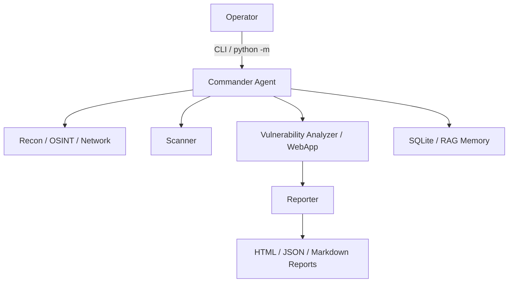

<div align="center">
  
  <h1>AgentPent</h1>
  <p><strong>LLM tabanli, cok ajanli guvenlik degerlendirme orkestrasyonu</strong></p>
  <p>Yetkili ortamlarda kesif, tarama, analiz ve raporlama akislarini tek bir CLI uzerinden yoneten deneysel bir Python projesi.</p>
  <p>
    <a href="https://github.com/EmreMetin00007/AgentPent/actions/workflows/ci.yml"></a>
  </p>
</div>

## Genel Bakis

AgentPent, farkli uzman rollere ayrilmis ajanlari tek bir orkestrasyon katmaninda birlestirir. Amac, yetkili guvenlik testlerinde operatorun tekrar eden adimlarini azaltmak, kapsam kontrollerini merkezi hale getirmek ve ciktilarin daha duzenli raporlanmasini saglamaktir.

Mevcut yapi asagidaki alanlara odaklanir:

- Recon, OSINT, ag, web uygulama ve raporlama icin ayrilmis ajan modulleri
- `scope_guard` ile hedef kapsami dogrulama
- HTML, JSON ve Markdown rapor uretimi
- SQLite tabanli gorev ve RAG hafiza bilesenleri
- Typer + Rich tabanli CLI deneyimi
- Testlerle desteklenen arac sarmalayicilari

## Mimari



## Hizli Baslangic

### Gereksinimler

- Python 3.11+ gerekir
- `git`
- Linux tarafinda ek pentest araclari kullanacaksan `nmap`, `nikto`, `sqlmap`, `dirb`, `smbclient`

### Kurulum

En hizli Linux/Kali kullanimi:

```bash
git clone https://github.com/EmreMetin00007/AgentPent.git
cd AgentPent
chmod +x agentpent
./agentpent --help
```

Bu launcher ilk calistirmada `.venv` olusturur, Python bagimliliklarini kurar ve `.env` yoksa `.env.example` uzerinden olusturur.

```bash
git clone https://github.com/EmreMetin00007/AgentPent.git
cd AgentPent
py -3.11 -m venv .venv
```

Linux ve macOS:

```bash
source .venv/bin/activate
python -m pip install --upgrade pip
python -m pip install -r requirements.txt
cp .env.example .env
```

Windows PowerShell:

```powershell
py -3.11 -m venv .venv
.venv\Scripts\Activate.ps1
python -m pip install --upgrade pip
python -m pip install -r requirements.txt
Copy-Item .env.example .env
```

Alternatif olarak Linux/Kali ortaminda hizli kurulum icin:

```bash
chmod +x setup.sh
./setup.sh
```

## Konfigurasyon

Temel ayarlar `.env` uzerinden yonetilir. En sik kullanilan alanlar:

- `AGENTPENT_OPENAI_API_KEY`
- `AGENTPENT_OPENAI_BASE_URL`
- `AGENTPENT_DEFAULT_MODEL`
- `AGENTPENT_PLANNING_MODEL`
- `AGENTPENT_THINKING_MODEL`
- `AGENTPENT_REQUIRE_SCOPE`
- `AGENTPENT_LOG_LEVEL`

Varsayilan ornekler icin `.env.example` dosyasini kullanabilirsin.

## CLI Kullanimi

Kayitli ajanlari listeleme:

```bash
./agentpent agents
```

Scope profillerini goruntuleme:

```bash
./agentpent scope
./agentpent check 10.10.10.5 --profile default
```

Demo rapor uretme:

```bash
./agentpent report --demo --format html
```

Bir gorev calistirma:

```bash
./agentpent mission --name "Demo Mission" --target 10.10.10.5
```

Tek faz calistirma:

```bash
./agentpent mission --name "Recon Only" --target example.lab --phase reconnaissance
```

## Gelistirme

Testleri calistirma:

```bash
python -m pytest
```

`pytest.ini` yalnizca kok `tests/` dizinini toplar. Bu sayede calisma klasorunde tutulan gomulu veya harici repolar test kesfini bozmaz.

Onerilen gelistirme akisi:

1. Sanal ortami etkinlestir.
2. `python -m pip install -r requirements.txt` ile bagimliliklari kur.
3. Degisiklik yap.
4. `python -m pytest` ile dogrula.
5. Commit ve push et.

## CI ve Release

- GitHub Actions yapilandirmasi: `.github/workflows/ci.yml`
- Surum notlari: `CHANGELOG.md`
- Manuel yayin adimlari: `RELEASE.md`

## Yasal Not

Bu repo yalnizca acik izin verilen laboratuvarlar, dahili guvenlik testleri ve yetkili degerlendirme senaryolari icin kullanilmalidir. Hedef kapsami ve erisim yetkisi operatorun sorumlulugundadir.
