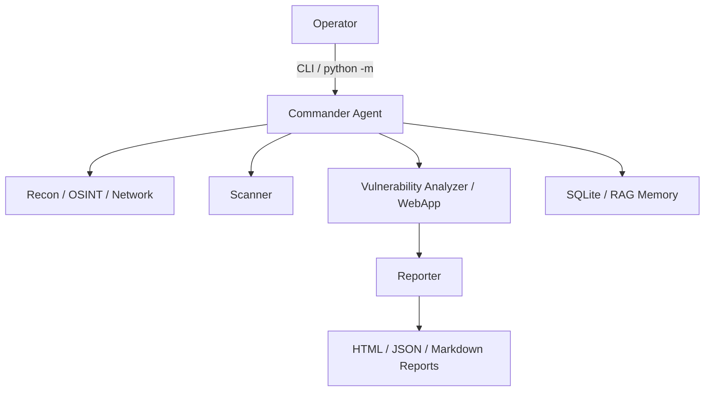

<div align="center">
  
  <h1>AgentPent</h1>
  <p><strong>LLM tabanlı, çok ajanlı güvenlik değerlendirme orkestrasyonu</strong></p>
  <p>Yetkili ortamlarda keşif, tarama, analiz ve raporlama akışlarını tek bir CLI üzerinden yöneten deneysel bir Python projesi.</p>
  <p>
    <a href="https://github.com/EmreMetin00007/AgentPent/actions/workflows/ci.yml"></a>
  </p>
</div>

## Genel Bakış

AgentPent, farklı uzman rollere ayrılmış ajanları tek bir orkestrasyon katmanında birleştirir. Amaç, yetkili güvenlik testlerinde operatörün tekrar eden adımlarını azaltmak, kapsam kontrollerini merkezi hale getirmek ve çıktıların daha düzenli raporlanmasını sağlamaktır.

Mevcut yapı aşağıdaki alanlara odaklanır:

- Recon, OSINT, ağ, web uygulama ve raporlama için ayrılmış ajan modülleri
- `scope_guard` ile hedef kapsamı doğrulama
- HTML, JSON ve Markdown rapor üretimi
- SQLite tabanlı görev ve RAG hafıza bileşenleri
- Typer + Rich tabanlı CLI deneyimi
- Testlerle desteklenen araç sarmalayıcıları

## Mimari



## Hızlı Başlangıç

### Gereksinimler

- Python 3.11 önerilir
- `git`
- Linux tarafında ek pentest araçları kullanacaksan `nmap`, `nikto`, `sqlmap`, `dirb`, `smbclient`

### Kurulum

```bash
git clone https://github.com/EmreMetin00007/AgentPent.git
cd AgentPent
python -m venv .venv
```

Linux ve macOS:

```bash
source .venv/bin/activate
python -m pip install --upgrade pip
python -m pip install -r requirements.txt
cp .env.example .env
```

Windows PowerShell:

```powershell
.venv\Scripts\Activate.ps1
python -m pip install --upgrade pip
python -m pip install -r requirements.txt
Copy-Item .env.example .env
```

Alternatif olarak Linux/Kali ortamında hızlı kurulum için:

```bash
chmod +x setup.sh
./setup.sh
```

## Konfigürasyon

Temel ayarlar `.env` üzerinden yönetilir. En sık kullanılan alanlar:

- `AGENTPENT_OPENAI_API_KEY`
- `AGENTPENT_OPENAI_BASE_URL`
- `AGENTPENT_DEFAULT_MODEL`
- `AGENTPENT_PLANNING_MODEL`
- `AGENTPENT_REQUIRE_SCOPE`
- `AGENTPENT_LOG_LEVEL`

Varsayılan örnekler için `.env.example` dosyasını kullanabilirsin.

## CLI Kullanımı

Kayıtlı ajanları listeleme:

```bash
python -m cli.main agents
```

Scope profillerini görüntüleme:

```bash
python -m cli.main scope
python -m cli.main check 10.10.10.5 --profile default
```

Demo rapor üretme:

```bash
python -m cli.main report --demo --format html
```

Bir görev çalıştırma:

```bash
python -m cli.main mission --name "Demo Mission" --target 10.10.10.5
```

Tek faz çalıştırma:

```bash
python -m cli.main mission --name "Recon Only" --target example.lab --phase reconnaissance
```

## Geliştirme

Testleri çalıştırma:

```bash
python -m pytest
```

`pytest.ini` yalnızca kök `tests/` dizinini toplar. Bu sayede çalışma klasöründe tutulan gömülü veya harici repolar test keşfini bozmaz.

Önerilen geliştirme akışı:

1. Sanal ortamı etkinleştir.
2. `python -m pip install -r requirements.txt` ile bağımlılıkları kur.
3. Değişiklik yap.
4. `python -m pytest` ile doğrula.
5. Commit ve push et.

## CI ve Release

- GitHub Actions yapılandırması: `.github/workflows/ci.yml`
- Sürüm notları: `CHANGELOG.md`
- Manuel yayın adımları: `RELEASE.md`

İleride istersen bu yapıyı otomatik tag ve GitHub Release akışıyla da genişletebiliriz.

## Yasal Not

Bu repo yalnızca açık izin verilen laboratuvarlar, dahili güvenlik testleri ve yetkili değerlendirme senaryoları için kullanılmalıdır. Hedef kapsamı ve erişim yetkisi operatörün sorumluluğundadır.
